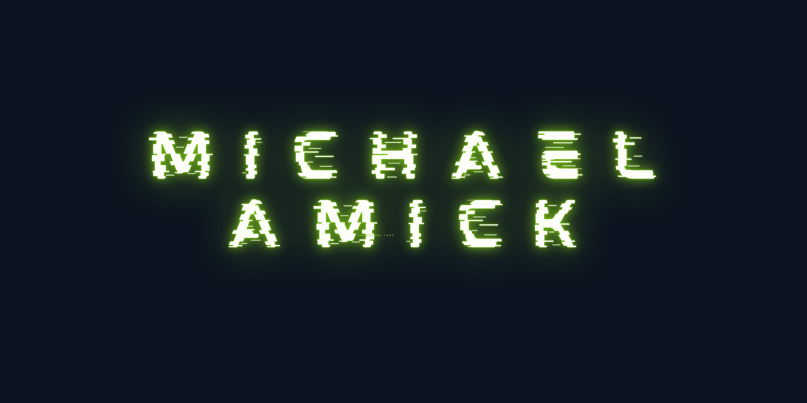

## About Me
Experienced computer scientist and information technology professional with experience as a cyber officer and civilian in the U.S. Air Force. Extensively trained problem solver, leader, and instructor with experience in networking, operations, security, testing, and software development. I'm passionate about automation, DevOps, empowering teams, and elegant solutions.

## Favorite Learning Tools

